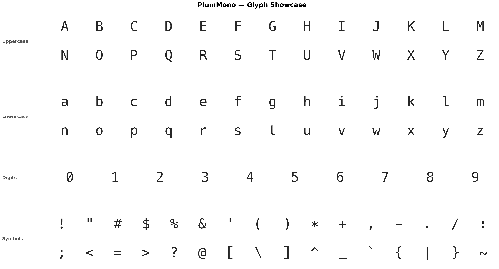

# Plum Mono

A monospaced typeface for source code, based on [Hack](https://github.com/source-foundry/Hack).



---

## About

Plum Mono is a derivative of the [Hack](https://github.com/source-foundry/Hack) typeface,
which itself builds upon [DejaVu Sans Mono](https://dejavu-fonts.github.io/) and
[Bitstream Vera Sans Mono](https://www.gnome.org/fonts/).

This project modifies a selection of Hack's punctuation and symbol glyphs to give them a different visual character, using glyph designs from DejaVu Sans Mono as a basis with custom adjustments.

---

## Modifications

### Replaced glyphs

The following glyphs were replaced with versions from DejaVu Sans Mono and **bolder**
(interpolated between the Regular and Bold weights):

| Glyph | Unicode |
|---|---|
| `:` | U+003A |
| `;` | U+003B |
| `,` | U+002C |
| `.` | U+002E |
| `"` | U+0022 |
| `'` | U+0027 |
| `*` | U+002A |

### Additional adjustments

- **Asterisk** `*` — vertically centered to align with `+`
- **Underscore** `_` — extended to full width so adjacent underscores connect (`__` → no gap)
- **Digit** `1` — top serif angle adjusted to a middle ground between Hack and DejaVu
- **Digit** `0` — slashed zero with consistent slash width across all weights (Regular, Italic, Bold, Bold Italic)

---

## Hinting

Plum Mono uses `ttfautohint` for TrueType hinting.

The manual `ttfautohint` control instruction (`tt-hinting/*.txt`) files included in this project are derived from the corresponding hinting files in the [Hack](https://github.com/source-foundry/Hack) project. These files are used to provide manual control over the hinting generated by `ttfautohint`.

The hinting files are distributed under the applicable copyright and license notices described in [LICENSE](LICENSE).

---

## Building

```bash
python build.py --install-deps
python build.py ttf
```

Requires: Python 3, fontmake, fonttools, ttfautohint.

---

## License

Plum Mono is licensed under the MIT License.

Plum Mono is a derivative of Hack, which is licensed under the MIT License and incorporates work from the DejaVu project and Bitstream Vera Sans Mono.

The manual ttfautohint control instruction (`tt-hinting/*.txt`) files used in the Plum Mono build are derived from files distributed with Hack.

See LICENSE for the complete license texts, copyright notices, and attribution information.
